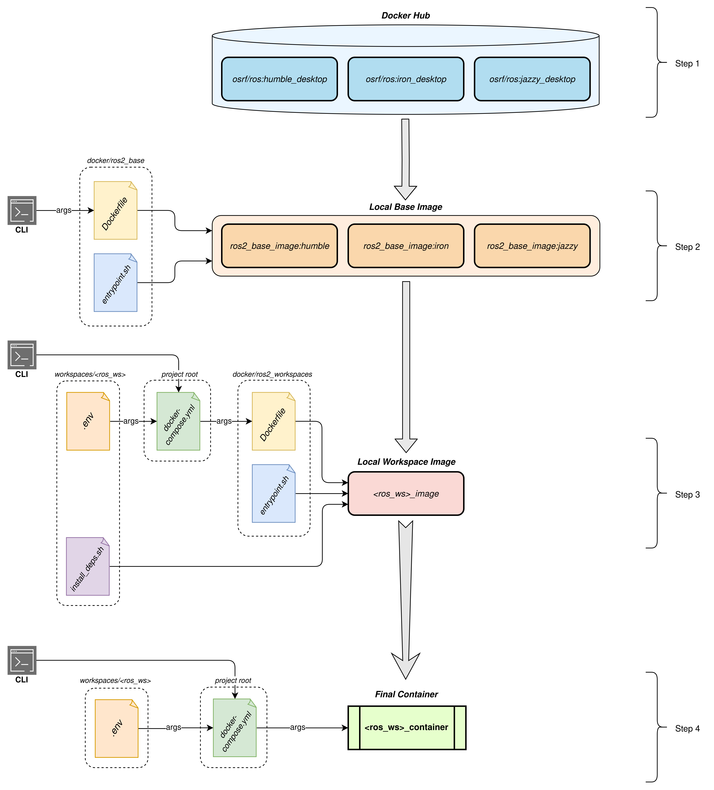

# ROS 2 Manager - A Framework for ROS 2 Workspace Management

<div style="text-align: center;">
   
   
</div>


## Overview

ROS 2 Manager is a framework designed to simplify the management of ROS 2 workspaces, each with its unique dependencies and specific ROS 2 version.
By creating Docker containers customized for each workspace, it automates tasks like dependency installation and environment configuration, minimizing manual setup requirements.

### Use Cases for ROS 2 Manager

Here are some situations that could benefit from the use of ROS 2 Manager:
- You need a package only available in a newer ROS 2 version than the one on your system.
- You prefer not to install a new project and its dependencies directly on your system.
- You want to test a workspace in a different ROS 2 version without reconfiguring extensively.
- You need to run multiple packages with conflicting dependencies that cannot coexist in the same environment.
- You use a Linux distribution that lacks native ROS 2 support but still want ROS 2 functionality.

If these scenarios resonate, give ROS 2 Manager a try.


## Setup and Usage

Follow these steps to set up and use ROS 2 Manager.

### 0. Prerequisites

Make sure that *Docker* is installed and correctly working on your system.

### 1. Building the Base Image

The `ros2_base` image serves as the foundation for the environment.
You can build it for different ROS 2 distributions according to your workspace configuration.

To build the base image for a chosen ROS 2 distribution, navigate to the `docker/ros2_base/` directory and run:
```sh
docker build --build-arg UID=$(id -u) --build-arg GID=$(id -g) --build-arg ROS2_DISTRO=<ros2_version> -t ros2_base_image:<ros2_version> .
```

Replace `<ros2_version>` with your target ROS 2 distribution, choosing from *humble*, *iron*, or *jazzy* (these are the tested ones).

### 2. Adding a New ROS 2 Workspace

To add a new ROS 2 workspace (`<ws_name>`), organize your files in the following structure:
```text
<ws_name>
├── docker
|   ├── .env
│   └── install_deps.sh
└── src
    ├── <new_package_A>
    ├── <new_package_B>
    └── ...
```

Since you will already have your `src` directory with the packages, create only the `docker` directory and the following two files within it:
| File | Description |
| :--- | :--- |
| `.env` | Configuration file containing environment variables for building the Docker image and running the container for the workspace. |
| `install_deps.sh` | Shell script with commands to install dependencies required by the workspace packages. |

Refer to the example workspaces to guide your setup and copy these files with necessary adjustments:
- Adjustements for `.env`:
   - Set `ROS2_DISTRO` to the appropriate version (*humble*, *iron*, or *jazzy*).
   - Set `PROJECT_NAME` with the root directory name (default is *ros2_manager*).
   - Set `ROS2_WS_NAME` to your new workspace’s name.
- Adjustements for `install_deps.sh`:
   - Add commands to install packages with *apt*, using `${ROS2_DISTRO}` to parameterize the ROS 2 version.
   - Include any additional installation commands (e.g., with *pip*, from source, etc.).

### 3. Building and Running Workspace Images

Each ROS 2 workspace runs in its own isolated container with a custom Docker image, containing only the required dependencies by that workspace.
Before proceeding, ensure that the `ros2_base` image has already been built as instructed above.

#### 3.1 Build the Docker Image

To build the Docker image for a specific workspace, navigate to the project’s root directory and run:
```sh
docker compose --env-file ./workspaces/<ws_name>/docker/.env build
```

#### 3.2 Launch the Workspace Container

To start the workspace container, run:
```sh
docker compose --env-file ./workspaces/<ws_name>/docker/.env -p <ws_name> up
```

#### 3.3 Access the Container’s Shell

To open a shell in the running container, use:
```sh
docker exec -it <ws_name>_container /bin/bash
```

At this point, you can start using the workspace as if it were running locally.

## Implementation details

> **NOTE**: If you are not interested in knowing in details how this framework is implemented, then you can skip this section.

This project is organized into multiple ROS 2 workspaces, each containing one or more packages and running in its own Docker container.

Below are the steps of the containerization process used for this project:
1. We begin by using an initial ROS Docker image provided by OSRF (available on Docker Hub), which comes with ROS pre-installed.
2. From this initial image, we create a custom base image by adding common utilities that will be used across all containers.
3. We use the custom base image to build specific images for each workspace, ensuring each container has the necessary dependencies and configurations to run the workspace's code.
4. Finally, we are ready to instance a container for the specific image of each workspace.

The following diagram illustrates the containerization and build process.

<figure style="text-align:center">
   
</figure>

### Step 1

The initial Docker image we use is the a ROS 2 image officialy provided by the Open Source Robotic Foundation (OSRF) on Docker Hub.
In particular, this framework has been tested with three images: *ROS 2 Humble*, *ROS 2 Iron*, and *ROS 2 Jazzy*. 

This image provides a full ROS 2 installation on top of the right version of Ubuntu, comprehending both core packages necessary to run ROS 2 and its GUI tools.

### Step 2

Starting from the OSRF official image, we create a custom Docker base image as specified in `docker/ros2_base/Dockerfile`.

This Dockerfile primarily performs the following tasks:
- creating a new user with sudo support matching the host user's UID and GID, enabling non-root operations with identical file read/write permissions as the host user;
- installing basic utilities (e.g., *vim*, *xterm*, *evince*) and *CycloneDDS* for ROS 2, so that the user can already find preintalled this frequently used tools;
- copying and executing the `docker/ros2_base/entrypoint.sh` script, which ensures the *.bashrc* file is configured to automatically source the ROS 2 installation.

The above characteristics will be inherited by all subsequent images built on top of it, including those for each workspace.

### Step 3

After creating the custom base image, specific images for each workspace can be built using the `docker/ros2_workspaces/Dockerfile` through the `docker-compose.yml` file.

This Dockerfile primarily performs the following tasks:
- copying and executing the `docker/ros2_workspaces/entrypoint.sh` script, which ensures the *.bashrc* file is configured to automatically source both the ROS 2 installation and the specific ROS 2 workspace;
- copying and executing the `workspaces/<ws_name>/docker/install_deps.sh` script, which installs the depenencies required by the workspace to correctly work.

At this point we obtain the final image, customized for the specific workspace that it will be used for.

### Step 4

Finally, in the last step we can instance a Docker container of the image created at Step 3.

The `docker-compose.yml` file is also used to define all necessary environment variables (required due to the parametric nature of this solution) and to mount the directory containing the ROS 2 workspace from the host filesystem to the container's filesystem.

This mounting allows all ROS 2 workspaces to remain on the host system, enabling their management as standard directories while leveraging ROS 2 Manager for compilation and execution.


## Example Workspaces

This repository includes example workspaces, `workspace1_ws` and `workspace2_ws`, each containing two empty packages to demonstrate the ROS 2 Manager directory structure.

### First Run

As `workspace1_ws` uses ROS 2 Humble and `workspace2_ws` uses ROS 2 Jazzy, build the respective `ros2_base` images:
```sh
docker build --build-arg UID=$(id -u) --build-arg GID=$(id -g) --build-arg ROS2_DISTRO=humble -t ros2_base_image:humble .
docker build --build-arg UID=$(id -u) --build-arg GID=$(id -g) --build-arg ROS2_DISTRO=jazzy -t ros2_base_image:jazzy .
```

This process may take some time but only needs to be completed once per ROS 2 version.

Though the example packages are intentionally empty, `docker/install_deps.sh` in each workspace includes sample dependencies for demonstration.

To build the two workspace images, run:
```sh
docker compose --env-file ./workspaces/example1_ws/docker/.env build
docker compose --env-file ./workspaces/example2_ws/docker/.env build
```

Depending on the number of dependencies in `docker/install_deps.sh`, this step may take a while.
However, similar to the base images, this needs to be done only once per workspace or when dependencies change.

To start containers for the two workspaces, run:
```sh
docker compose --env-file ./workspaces/example1_ws/docker/.env -p example1 up
docker compose --env-file ./workspaces/example2_ws/docker/.env -p example2 up
```

To access a shell inside the two running containers, use:
```sh
docker exec -it example1_ws_container /bin/bash
docker exec -it example2_ws_container /bin/bash
```

You are now ready to build your workspaces with `colcon` or perform other operations.

### Subsequent Runs

After building the base and workspace images, subsequent runs only require container startup and shell access, reducing setup time.
If a workspace’s dependencies are updated (in `docker/install_deps.sh`), rebuild its image to include the changes.


## Troubleshooting

### Visualizing GUI Programs

If you are unable to visualize GUI programs in your container, you may need to disable access control on the X server to allow incoming connections:
```sh
xhost +x
```


## Author

- **Leonardo Gargani**, Ph.D. Student @ AIRLab, Politecnico di Milano [[LinkedIn](https://www.linkedin.com/in/leonardogargani)][[GitHub](https://github.com/leonardogargani)]
